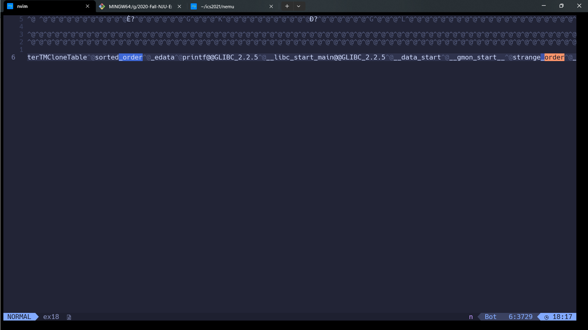
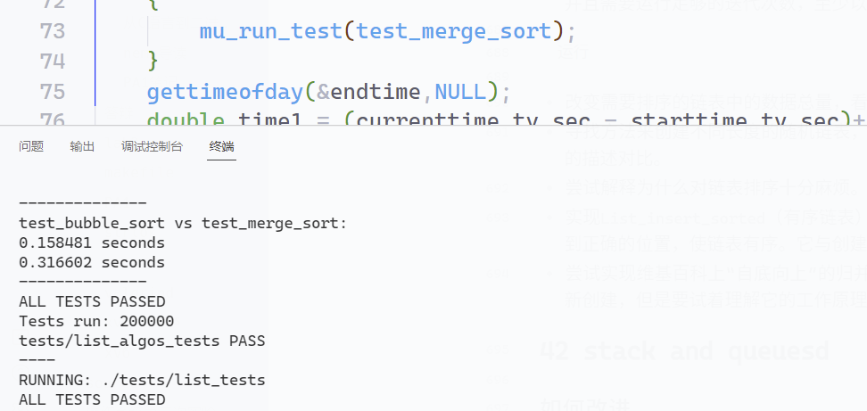

### Tasks
>练习 0 到练习 18，练习 32，练习 33，练习 42，练习 44 需要完成编程算法以及附加题.

### 3: 格式化输出

>对于这个练习，我想让你上网搜索 `printf` 的所有格式化占位符和转义序列。转义序列类似 `\n` 或者 `\r`，可以让你分别打印新的一行或者 tab 。格式化占位符类似 `%s` 或者 `%d`，可以让你打印字符串或整数。找到所有的这些东西，以及如何修改它们，和可设置的“精度”和宽度的种类。

当使用 `printf` 函数时，我们需要提供一个格式化字符串和一系列用于填充格式化字符串的参数。格式化字符串是一个包含普通文本和格式占位符的字符串。格式占位符指示了输出的数据类型和如何进行格式化。

下面是 `printf` 函数的详细用法：
```c
#include <stdio.h>

int main() {
    // 格式化字符串以及参数
    int num = 42;
    float pi = 3.14159;
    char letter = 'A';
    char str[] = "Hello";

    // 输出整数
    printf("Integer: %d\n", num);

    // 输出浮点数
    printf("Float: %f\n", pi);

    // 输出字符
    printf("Character: %c\n", letter);

    // 输出字符串
    printf("String: %s\n", str);

    return 0;
}

```
输出将是：
```c
Integer: 42
Float: 3.141590
Character: A
String: Hello

```
在格式化字符串中，我们使用占位符来指示输出的数据类型：

- `%d`: 输出整数
- `%f`: 输出浮点数
- `%c`: 输出字符
- `%s`: 输出字符串

除了这些基本占位符，还可以使用其他修饰符来控制输出的格式。以下是一些常见的修饰符：

- `%.nf`: 控制浮点数的精度，`n`表示要显示的小数位数。
- `%m.nf`: 控制浮点数的宽度和精度，`m`表示总宽度，`n`表示小数位数。
- `%md`: 控制整数的宽度，`m`表示总宽度，如果数值宽度不足，会用空格在左边补齐。
- `%-md`: 控制整数的宽度，`m`表示总宽度，如果数值宽度不足，会用空格在右边补齐。

示例：
```c
#include <stdio.h>

int main() {
    int num = 42;
    float pi = 3.14159;

    // 控制浮点数的精度
    printf("Pi with 2 decimal places: %.2f\n", pi);

    // 控制整数的宽度
    printf("Number with width of 6: %6d\n", num);

    // 控制整数的宽度，左对齐
    printf("Number with width of 6, left aligned: %-6d\n", num);

    return 0;
}

```

输出
```c
Pi with 2 decimal places: 3.14
Number with width of 6:     42
Number with width of 6, left aligned: 42    

```

### 4: Valgrind
#### 附加题

- 按照上面的指导，使用`Valgrind`和编译器修复这个程序。
- 在互联网上查询`Valgrind`相关的资料。
- 下载另一个程序并手动构建它。尝试一些你已经使用，但从来没有手动构建的程序。
- 看看 `Valgrind` j，并且阅读它的 Makefile 文件。不要担心，这对我来说没有任何意义。

##### 错误输出
```txt
==15752== Memcheck, a memory error detector
==15752== Copyright (C) 2002-2017, and GNU GPL'd, by Julian Seward et al.
==15752== Command: ./ex4
==15752==
I am -16778712 years old.
==15752== Conditional jump or move depends on uninitialised value(s)
==15752==    at 0x48D5958: __vfprintf_internal (vfprintf-internal.c:1687)
==15752==    by 0x48BFD3E: printf (printf.c:33)
==15752==    by 0x109182: main (ex4.c:8)
==15752==
==15752== Use of uninitialised value of size 8
==15752==    at 0x48B969B: _itoa_word (_itoa.c:179)
==15752==    by 0x48D5574: __vfprintf_internal (vfprintf-internal.c:1687)
==15752==    by 0x48BFD3E: printf (printf.c:33)
==15752==    by 0x109182: main (ex4.c:8)
==15752==
==15752== Conditional jump or move depends on uninitialised value(s)
==15752==    at 0x48B96AD: _itoa_word (_itoa.c:179)
==15752==    by 0x48D5574: __vfprintf_internal (vfprintf-internal.c:1687)
==15752==    by 0x48BFD3E: printf (printf.c:33)
==15752==    by 0x109182: main (ex4.c:8)
==15752==
==15752== Conditional jump or move depends on uninitialised value(s)
==15752==    at 0x48D6228: __vfprintf_internal (vfprintf-internal.c:1687)
==15752==    by 0x48BFD3E: printf (printf.c:33)
==15752==    by 0x109182: main (ex4.c:8)
==15752==
==15752== Conditional jump or move depends on uninitialised value(s)
==15752==    at 0x48D56EE: __vfprintf_internal (vfprintf-internal.c:1687)
==15752==    by 0x48BFD3E: printf (printf.c:33)
==15752==    by 0x109182: main (ex4.c:8)
==15752==
I am 0 inches tall.
==15752==
==15752== HEAP SUMMARY:
==15752==     in use at exit: 0 bytes in 0 blocks
==15752==   total heap usage: 1 allocs, 1 frees, 1,024 bytes allocated
==15752==
==15752== All heap blocks were freed -- no leaks are possible
==15752==
==15752== Use --track-origins=yes to see where uninitialised values come from
==15752== For lists of detected and suppressed errors, rerun with: -s
==15752== ERROR SUMMARY: 5 errors from 5 contexts (suppressed: 0 from 0)
```


```c
#include <stdio.h>
  8 /* Warning: This program is wrong on purpose. */
  7 int main()
  6 {
  5     int age = 10;
  4     int height;//not initialize
  3     printf("I am %d years old.\n");
  2     printf("I am %d inches tall.\n", height);
  1     return 0;
10  }    
```

### 6: 变量类型
你可以看到我们拥有一系列的“类型”，它们告诉编译器变量应该表示成什么，之后格式化字符串会匹配不同的类型。下面解释了它们如何匹配：

整数

　　使用`int`声明，使用`%d`来打印。

浮点

　　使用`float`或`double`声明，使用`%f`来打印。

字符

　　使用`char`来声明，以周围带有`'`（单引号）的单个字符来表示，使用`%c`来打印。

字符串（字符数组）

　　使用`char name[]`来声明，以周围带有`"`的一些字符来表示，使用`%s`来打印。

你会注意到 C 语言中区分单引号的 `char` 和双引号的 `char[]` 或字符串。

```shell
❯ valgrind ./ex6 >valgrind.txt 2>&1
```

```txt
==17712== Invalid read of size 1
==17712==    at 0x483EF46: strlen (in /usr/lib/x86_64-linux-gnu/valgrind/vgpreload_memcheck-amd64-linux.so)
==17712==    by 0x48D6D14: __vfprintf_internal (vfprintf-internal.c:1688)
==17712==    by 0x48BFD3E: printf (printf.c:33)
==17712==    by 0x109235: main (in /home/along/c_tutor/chardway/ex6/ex6)
==17712==  Address 0x41 is not stack'd, malloc'd or (recently) free'd
```

### 17 栈和堆
`fflush` 函数也是在文件操作中常见的函数之一，它用于刷新（清空）输出缓冲区。在许多编程语言中，输出操作（例如使用 `printf` 函数打印内容）通常会先将数据写入到一个内存缓冲区中，然后再根据一定条件将缓冲区中的内容写入到文件或显示屏上。`fflush` 函数可以用来强制将缓冲区中的内容立即写入到文件。

`fflush` 函数的一般语法是：

```c
int fflush(FILE *stream);
```

这里的 `stream` 是一个指向要刷新的文件流的指针。该函数的返回值通常用于指示操作是否成功。

示例如下：

```c
#include <stdio.h>

int main() {
    FILE *file = fopen("output.txt", "w"); // 打开一个文本文件用于写入

    if (file == NULL) {
        perror("无法打开文件");
        return 1;
    }

    fprintf(file, "这是一行文本\n");

    // 刷新输出缓冲区，将内容写入文件
    fflush(file);

    fclose(file); // 关闭文件

    return 0;
}
```

在这个示例中，我们打开一个文本文件 "output. txt" 用于写入，然后使用 `fprintf` 函数将一行文本写入文件。接着，调用 `fflush` 函数强制将输出缓冲区中的内容写入文件，然后关闭文件。

需要注意的是，虽然很多时候系统会自动地在适当的时候刷新输出缓冲区，但在一些情况下（例如在程序结束前），手动使用 `fflush` 可以确保数据被立即写入文件。此外，在读写文件时，也可以通过设置缓冲模式来控制缓冲区的行为。

#### 下面是三个值得关注的关于栈和堆的主要问题：

- 如果你从`malloc`获取了一块内存，并且把指针放在了栈上，那么当函数退出时，指针会被弹出而丢失。
- 如果你在栈上存放了大量数据（比如大结构体和数组），那么会产生“栈溢出”并且程序会中止。这种情况下应该通过`malloc`放在堆上。
- 如果你获取了指向栈上变量的指针，并且将它用于传参或从函数返回，接收它的函数会产生“段错误”。因为实际的数据被弹出而消失，指针也会指向被释放的内存。
#### 附加题

- `die` 函数需要接收 `conn` 变量作为参数，以便执行清理并关闭它。

	挺呃呃的这要求 (本来这些仅调用 die 打印字符串的函数又得多传个 NULL, C 语言又不支持默认参数)
	
- 修改代码，使其接收参数作为 `MAX_DATA` 和 `MAX_ROWS`，将它们储存在 `Database` 结构体中，并且将它们写到文件。这样就可以创建任意大小的数据库。
	

- 向数据库添加更多操作，比如`find`。
- 查询 C 如何打包结构体，并且试着弄清楚为什么你的文件是相应的大小。看看你是否可以计算出结构体添加一些字段之后的新大小。
	>-rw-r--r-- 1 along along 103200 Aug 11 16:37 db. dat
	(4+4+1024)\*100=103200//4Bytes 整数倍符合内存对齐原则
- 向 `Address` 添加一些字段，使它们可被搜索。
	
- 编写一个 shell 脚本来通过以正确顺序运行命令执行自动化测试。提示：在 `bash` 顶端使用使用 `set -e`，使之在任何命令发生错误时退出。

```
1 bCM0f6xSizFcvfabkGSfkCvbXT8ap22M5yXiuRmVMdMGkszNiycSFCVudSMc7Q0zAVNyWuuH9rjh67QK6zycFg41LTEQa7UPnk3nr3iZj5Ntt5tN4FjwJonQ9Kkml2VMXS3PA42WsmgLXvGPELj3yWr3mHNnZch5wQUzfDchX0YN597T7QSK9cbwTtTalvWXYiNFRDFuOpc5TyeFz79YEF1f9fQ5wIokbwqSf3Ct1j13Ts8ux4BFjt5cPqv1fVT40DlmPhtQWrn19EnD3BMFrmhpTSMrR4XMR2negFBhE6xczdwo9HPK4QCa1hcbyttAQaJfCQaAjdLm2nSLx2doGBccWZEYJcsnOIAl9cvOsKVYXtUIUgAzzcoMaabKzDs8g6O2lTv4Awcsy5ugXg4hBlLpbNMjPbjPN9cWmYzYAWWKE6xPtVwwQkeCF1mUHgtu57JSwX3fz8RE4bvNKNasRVbtUTleX8N6hHkeH5pnB0hgG9wSujJMiB2tQAb4UJYwzed@zedshaw.com zed@zedshaw.com
```

错误的事情是, email 被输出在 name 之后了, name 的'\0'被覆盖掉, printf 会一直打印到相邻的 email 直到遇到'\0'

    
    > 译者注：使用Python编写多行脚本或许更方便一些。
    
- 尝试重构程序，使用单一的全局变量来储存数据库连接。这个新版本和旧版本比起来如何？


- 搜索“栈数据结构”，并且在你最喜欢的语言中实现它，然后尝试在 C 中实现。

### 18: 函数指针

匿名结构体+函数指针
```c
  static struct {

  const char *name;

  const char *description;

  int (*handler) (char *);

} cmd_table [] = {

  { "help", "Display informations about all supported commands", cmd_help },

  { "c", "Continue the execution of the program", cmd_c },

  { "q", "Exit NEMU", cmd_q },

  {"info","info something",cmd_info},

  {"si","si [N] execute N instructions",cmd_si},

  {"x","x N EXPR",cmd_x},

  {"p","p EXPR",cmd_p},

  /* TODO: Add more commands */

};
```

匿名结构体（Anonymous Struct）是指在定义结构体变量的同时直接定义结构体本身，而不给结构体命名。这样的结构体在特定的作用域内只能被该结构体变量使用，无法在其他地方再次使用，因为它没有命名。匿名结构体通常用于一些临时或局部的数据结构，避免了在全局范围内定义结构体类型。

匿名结构体在 C 语言和 C++中都可以使用。以下是一个使用匿名结构体的示例：

```c
#include <stdio.h>

int main() {
    struct {
        int x;
        int y;
    } point;  // 定义一个匿名结构体并声明一个结构体变量

    point.x = 10;
    point.y = 20;

    printf("坐标：(%d, %d)\n", point.x, point.y);

    return 0;
}
```

在这个示例中，我们定义了一个没有命名的匿名结构体，它包含了两个整数字段 `x` 和 `y`。然后我们声明一个匿名结构体变量 `point`，并通过这个变量来访问结构体的字段。由于匿名结构体没有名字，它只能在当前作用域内使用。

需要注意的是，匿名结构体适用于某些特定情况，比如临时的、局部的数据结构。如果你需要在多个地方重复使用结构体类型，应该考虑给结构体命名，以便更好地组织和维护代码。

#### ex18's typedef pointers to functions
这段代码定义了一个名为 `compare_cb` 的类型别名（typedef），这个类型别名表示一个函数指针类型，用于指向一个具有特定参数和返回值的函数。

让我解释一下这段代码的每个部分：

```c
typedef int (*compare_cb)(int a, int b);
```

1. `typedef` ：这是 C 语言中用于创建类型别名的关键字。

2. `int (*compare_cb)` ：这是一个函数指针类型的声明，表示 `compare_cb` 是一个指向函数的指针。

3. `(int a, int b)` ：这是函数的参数列表，表示函数接受两个 `int` 类型的参数。

4. `int` ：这是函数的返回类型，表示函数返回一个 `int` 类型的值。

综合起来，这段代码定义了一个类型别名 `compare_cb`，它代表了一个指向接受两个 `int` 类型参数并返回 `int` 类型值的函数的指针类型。你可以使用这个类型别名来声明函数指针变量，并将其指向满足这个签名的函数。

例如，你可以这样使用这个类型别名：

```c
#include <stdio.h>

typedef int (*compare_cb)(int a, int b);

int compare(int a, int b) {
    return a - b;
}

int main() {
    compare_cb my_compare = compare;  // 使用类型别名声明函数指针变量

    int result = my_compare(5, 3);    // 调用比较函数

    printf("比较结果：%d\n", result);

    return 0;
}
```

在这个示例中，`compare_cb` 类型别名被用于声明 `my_compare` 函数指针变量，然后将其指向 `compare` 函数。通过 `my_compare` 变量，我们可以调用 `compare` 函数，并得到比较结果。

#### Extra 

- 用十六进制编辑器打开 `ex18`，接着找到函数起始处的十六进制代码序列，看看是否能在原始程序中找到函数。

- 在你的十六进制编辑器中找到更多随机出现的东西并修改它们。重新运行你的程序看看发生了什么。字符串是你最容易修改的东西。
- 将错误的函数传给`compare_cb`，并看看C编辑器会报告什么错误。
- 将`NULL`传给它，看看程序中会发生什么。然后运行`Valgrind`来看看它会报告什么。
- 编写另一个排序算法，修改 `test_sorting` 使它接收任意的排序函数和排序函数的比较回调。并使用它来测试两种排序算法。


###  20 调试宏
`__FUNCTION`, `__LINE__`, `__FILE`

```c
#define log_err(M, ...) fprintf(stderr,\
        "[ERROR] (%s:%d: errno: %s,function: %s) " M "\n", __FILE__, __LINE__,\
        clean_errno(), __FUNCTION__,##__VA_ARGS__)
```

`errno`
当 C 语言中的一些函数在执行过程中发生错误时，它们通常会将错误信息存储在一个名为 `errno` 的整数变量中，以便程序可以检查和处理这些错误。`errno` 是一个全局变量，它位于 `<errno.h>` 头文件中，并且可以在程序的任何地方访问。

以下是一些常见的使用 `errno` 的步骤和函数：

1. **包含头文件：** 在需要使用 `errno` 的源代码文件中，需要包含 `<errno.h>` 头文件。

2. **调用可能失败的函数：** 许多 C 函数（如文件 I/O、内存分配、网络通信等）在执行过程中可能会失败。当函数失败时，它们会设置 `errno` 并返回一个指示错误的值。

3. **检查 `errno` 的值：** 在调用可能失败的函数后，您可以检查 `errno` 的值来了解发生的错误类型。通常，`errno` 的值会在函数调用失败时被设置为一个特定的错误代码。您可以在 `<errno.h>` 中找到这些错误代码的定义。

4. **使用 `perror` 函数：** `perror` 函数允许您打印与 `errno` 关联的错误消息。它会自动查找适当的错误消息，并将其与您提供的自定义消息一起输出。

以下是一个使用 `errno` 和 `perror` 的示例：

```c
#include <stdio.h>
#include <stdlib.h>
#include <errno.h>

int main() {
    FILE *file = fopen("nonexistent_file.txt", "r");
    if (file == NULL) {
        perror("Error opening file");
        printf("Error code: %d\n", errno);
    }

    return 0;
}
```

在上面的示例中，如果文件打开失败，`fopen` 函数将设置 `errno`，然后 `perror` 函数将输出类似于 "Error opening file: No such file or directory" 的错误消息。

请注意，使用 `errno` 时需要小心，因为它在多线程环境中可能会导致问题。如果您的程序是多线程的，您可能需要使用线程本地存储（TLS）来确保每个线程都有自己独立的 `errno` 值。

最后，要正确处理错误，建议查阅相关函数的文档，以了解特定错误代码的含义和处理方法。


### 29 库和链接
- 你注意到我在 `libex29.c` 中写的不良代码了吗？我使用了一个 `for` 循环来检查 `'\0'` 的结尾，修改它们使这些函数总是接收字符串长度，并在函数内部使用。
- 使用项目框架目录，来为这个练习创建新的项目。将`libex29.c`放入`src/`目录，修改`Makefile`使它能够构建`build/libex29.so`。
- 将`ex29.c`改为`tests/ex29_tests.c`，使它做为单元测试执行。使它能够正常工作，意思是你需要修改它让它加载`build/libex29.so`文件，并且运行上面我手写的测试。
- 阅读`man dlopen`文档，并且查询所有有关函数。尝试`dlopen`的其它选项，比如`RTLD_NOW`。

#### wildcard
`wildcard` 是 Makefile 中的一个函数，用于匹配指定模式的文件名。

在上面的示例中，我们使用了以下代码：

```make
SOURCES = $(wildcard test/*.c)
```

这行代码的作用是将所有匹配 `test/*.c` 模式的文件名赋值给变量 `SOURCES`。这意味着它会找到 `test` 目录下所有以 `.c` 结尾的文件，然后将这些文件名组成一个列表赋值给 `SOURCES`。

在这个例子中，如果 `test` 目录下有 `test1.c`、`test2.c` 和 `test3.c` 这三个文件，那么 `SOURCES` 的值将是：

```
test/test1.c test/test2.c test/test3.c
```

我们之后可以在 Makefile 中使用这些文件列表，例如通过循环来生成相应的目标或规则。

`wildcard` 函数在 Makefile 中用于自动获取文件列表非常方便，特别是当文件数量较多或不断变化时。
#### patsubst
在 `Makefile` 中，`patsubst` 是一个函数，用于对字符串中的模式进行替换。它通常用于对文件名或路径进行模式匹配和转换，以生成新的文件名或路径。

`patsubst` 函数的基本语法如下：

```make
$(patsubst pattern,replacement,text)
```

- `pattern` ：要匹配的模式，可以包含通配符 `%`，用于匹配任意字符序列。
- `replacement` ：替换模式中的 `%` 部分，用于生成新的字符串。
- `text` ：要进行模式匹配和替换的原始字符串。

下面是一个示例，演示如何使用 `patsubst` 函数来替换文件路径中的模式：

```make
SOURCES := src/main.c src/utils.c src/other.c
OBJECTS := $(patsubst src/%.c,obj/%.o,$(SOURCES))

$(info Original sources: $(SOURCES))
$(info Translated objects: $(OBJECTS))

# 输出：
# Original sources: src/main.c src/utils.c src/other.c
# Translated objects: obj/main.o obj/utils.o obj/other.o
```

在这个示例中，我们使用 `patsubst` 将 `src/` 目录下的 `.c` 文件路径转换为 `obj/` 目录下的 `.o` 文件路径，生成了新的目标文件路径列表。

通常在 `Makefile` 中，您会在构建规则中使用 `patsubst` 函数来将源文件路径转换为目标文件路径，以确保正确的编译和链接。

==要记住在没有提供目标时`make`会默认运行第一个目标==。这里它叫做`all:`，并且它提供了`$(TARGET) tests`作为构建目标。查看`TARGET`变量，你会发现这就是库文件，所以`all:`首先会构建出库文件。之后，`tests`目标会构建单元测试。
### 32 双向链表

`int size = sizeof(arr)/sizeof(arr[0]);`

#### 如何改进

我打算告诉你如何改进代码，而不是使它崩溃。

```c
List *List_create()

{

    List* list = calloc(1, sizeof(List));

    list->count = 0;

    list->first = list->last = NULL;

    return list;

}
```


- 你可以使用 `LIST_FOREACH` 并在循环中调用 `free` 来使 `List_clear_destroy` 更高效。
```c
LIST_FOREACH(list,first,next,cur){

        free(cur->value);

        if(cur->prev){

            free(cur->prev);

        }

    }

    free(list->last);

    free(list);
```

- 你可以为一些先决条件添加断言，使其部结构`NULL`值作为`List *list`的参数。
- 你可以添加不变了，来检查列表的内容始终正确，例如`count`永远不会`< 0`，如果`count > 0`，`first`不为`NULL`。
- 你可以向头文件添加文档，在每个结构、函数和宏之前添加描述其作用的注释。

这些改进执行了防御性编程实践，并且“加固”了代码来避免_错误_或使用不当。马上去做这些事情，之后找到尽可能多的办法来改进代码。

#### 附加题

- 研究双向和单向链表，以及什么情况下其中一种优于另一种。
	- 时间和空间的 trade off (如果对时间复杂度要求高就双向, 如果对空间敏感就单向)
- 研究双向链表的限制。例如，虽然它们对于插入和删除元素很高效，但是对于变量元素比较慢。
- 还缺少什么你能想到的操作？比如复制、连接、分割等等。实现这些操作，并且为它们编写单元测试。
		可以试试复制唉
### 33 链表算法

#### 冒泡排序
示例的实现, 简洁但是可以优化
优化的方向: 
1. 如果一次循环均未发生 swap 则可以视为排序结
2. 每次循环一次, 都可以确定最后一位是最大的
示例代码
```c
int List_bubble_sort(List *list, List_compare cmp)

{

    int sorted = 1;

    if(List_count(list) <= 1) {

        return 0;  // already sorted

    }

    do {

        sorted = 1;

        LIST_FOREACH(list, first, next, cur) {

            if(cur->next) {

                if(cmp(cur->value, cur->next->value) > 0) {

                    ListNode_swap(cur, cur->next);

                    sorted = 0;

                }

            }

        }

    } while(!sorted);

    return 0;

}
```

我的代码
```c
int List_bubble_sort(List*list,List_compare cmp){

    int count = list->count;

    ListNode* cur = list->first;

        bool sorted = 1;

    for (int i = 0; sort&&i <count-1; i++)

    {

            sort = 0;

        for(int j=0;j<count-i-1;j++){

            if(cmp(cur->value,cur->next->value)>0){

                swap(cur,cur->next);

                    sort = 1;

            }

            cur = cur->next;

        }

  

    }

}
```
#### merge sort

归并排序


```c


```


```bash
1. `cc -g -O2 -Wall -Wextra -Isrc -rdynamic -DNDEBUG build/liblcthw.a tests/list_algos_tests.c -o tests/list_algos_tests`
2. `cc -g -O2 -Wall -Wextra -Isrc -rdynamic -DNDEBUG build/liblcthw.a tests/list_tests.c -o tests/list_tests`

```
如何实现 makefile 中对两个不同的 `_tests.c` 文件进行对应的编译
一开始 chatgpt 告诉我可以这么搞, 后来发现不太行,%(看起来指代就很不明显, 虽然这个示例跑的通, 但是对于 all 的多个 prerequist 来说,%应该指代哪一个呢)
```bash
TEST_SRC=$(wildcard tests/*_tests.c)
TESTS=$(patsubst %.c,%,$(TEST_SRC))

all: $(TESTS)

%: %.c
	@echo $@ ;
clean:
	rm -f $(TESTS)
```

```bash
❯ make
tests/list_algos_tests
tests/list_tests
```
使用 `.PHNOY` 禁止 makefile 来进行 implict rule 的实施, 这样就可以实现 (静态模式规则)(花了很长的时间最后才发现是自己没有认真看教程)
https://makefiletutorial.com/#static-pattern-rules
```
test: $(TESTS) $(TEST_SRC)

.PHONY: test

$(filter %,$(TESTS)):%:%.c

    $(CC) -Wall -g -DNDEBUG -Isrc -rdynamic $< $(TARGET) $(LIBS) -o $@
```

#### 如何改进

退回去查看算法描述，有一些方法可用于改进这些实现，其中一些是很显然的：

- 归并排序做了大量的链表复制和创建操作，寻找减少它们的办法。
- 归并排序的维基百科描述提到了一些优化，实现它们。
- 你能使用`List_split`和`List_join`（如果你实现了的话）来改进归并排序嘛？
- 浏览所有防御性编程原则，检查并提升这一实现的健壮性，避免`NULL`指针，并且创建一个可选的调试级别的不变量，在排序后实现`is_sorted`的功能。

#### 附加题

- 创建单元测试来比较这两个算法的性能。你需要 `man 3 time` 来查询基本的时间函数，并且需要运行足够的迭代次数，至少以几秒钟作为样本。
```
运行10000次
为什么会导致merge_sort比bubble_sort慢???????
我人麻了 说好的O(nlogn)呢?????????
```




没那个能力分析了你知道吧


- 改变需要排序的链表中的数据总量，看看耗时如何变化。
	将 ` #define NUM_VALUES sizeof (values)/sizeof (values[0])` 更普适
- 寻找方法来创建不同长度的随机链表，并且测量需要多少时间，之后将它可视化并与算法的描述对比。
	
- 尝试解释为什么对链表排序十分麻烦。
- 实现`List_insert_sorted`（有序链表），它使用`List_compare`，接收一个值，将其插入到正确的位置，使链表有序。它与创建链表后再进行排序相比怎么样？
- 尝试实现维基百科上“自底向上”的归并排序。上面的代码已经是 C 写的了，所以很容易重新创建，但是要试着理解它的工作原理，并与这里的低效版本对比。


### 42 stack and queuesd

#### 如何改进

你可以做到的唯一真正的改进，就是把所用的`List`换成`DArray`。`Queue`数据结构难以用`DArray`实现，因为它要同时处理两端的节点。

完全在头文件中来实现它们的缺点，是你并不能够轻易地对它做性能调优。你需要使用这种技巧，建立一种以特定的方式使用`List`的“协议”。做性能调优时，如果你优化了`List`，这两种数据结构都会有所改进。

#### 附加题

- 使用`DArray`代替`List`实现`Stack`，并保持单元测试不变。这意味着你需要创建你自己的`STACK_FOREACH`。
### 44 环形缓冲区

%%想重装系统了, 主要是这 neovim, lsp 没效果了 (了解的太少, 且没时间配置)%%

#### 如何改进

像往常一样，你应该为这个练习做防御性编程检查。我希望你这样做，是因为`liblcthw`的代码基本上没有做我教给你的防御型编程检查。我将它们留给你，便于你熟悉使用这些额外的检查来改进代码。

例如，这个环形缓冲区并没有过多检查每次访问是否实际上都在缓冲区内。

如果你阅读[环形缓冲区的维基百科页面](http://en.wikipedia.org/wiki/Ring_buffer)，你会看到“优化的POSIX实现”，它使用POSIX特定的调用来创建一块无限的区域。研究并且在附加题中尝试实现它。

#### 附加题

- 创建`RingBuffer`的替代版本，使用POSIX的技巧并为其执行单元测试。
- 为二者添加一个性能对比测试，通过带有随机数据和随机读写操作的模糊测试来比较两个版本。确保你你对每个版本进行了相同的操作，便于你在操作之间比较二者。
- 使用`callgrind` 和 `cachegrind`比较二者的性能。
## `dbg.h`
这位更是重量级
```c
#define check(A, M, ...) if(!(A)) {\

    log_err(M, ##__VA_ARGS__); errno=0; goto error; }
```
当在 C 语言中进行动态内存分配（例如使用 `malloc`、`calloc` 等函数）时，往往需要检查内存分配是否成功。宏定义 `check_mem(A)` 就是用于检查内存分配是否成功，并在失败的情况下执行相应的错误处理步骤。

这里是 `#define check_mem(A)` 的详细解释：

```c
#define check_mem(A) check((A), "Out of memory.")
```

这个宏利用了另一个宏定义 `check(A, M, ...)`，我们先看一下 `check` 宏：

```c
#define check(A, M, ...) if(!(A)) {\
    log_err(M, ##__VA_ARGS__); errno=0; goto error; }
```

现在我们回到 `check_mem` 宏：

- `check_mem(A)` 接受一个条件 `A` 作为参数，这个条件通常是一个指针，例如在进行内存分配后返回的指针。

- 宏的定义部分使用 `check(A, "Out of memory.")`，它会将 `A` 作为条件传递给 `check` 宏，并在条件为假时执行以下操作：
  - 调用 `log_err(M, ...)` 宏，这个宏用于打印错误信息。在这里，错误信息是 "Out of memory."，表示内存分配失败。
  - `##__VA_ARGS__` 是一个用于将可变数量的参数传递给宏的特殊语法。
  - 将 `errno` 设置为 0，以确保后续的错误处理不会受到之前可能的错误影响。
  - 使用 `goto error;` 跳转到错误处理部分，即 `error` 标签所在的位置。

	总结来说，`check_mem(A)` 宏的目的是检查内存分配是否成功，如果失败，就会打印错误信息并跳转到错误处理部分。这种错误处理机制有助于在内存分配失败时能够及时捕获并处理问题，避免悬空指针和内存泄漏等问题。如果有多个 `error label` 那么会就近 goto

### debug

这是一个用于输出调试信息的宏定义，它使用了可变参数（variadic macros）和预处理指令。这个宏被命名为 `debug`，以下是宏定义的详细解释：

```c
#define debug(M, ...) fprintf(stderr, "DEBUG %s:%d: " M "\n", \
    __FILE__, __LINE__, ##__VA_ARGS__)
```

1. `#define debug(M, ...)` : 这是宏的开始部分。`debug` 是宏的名称，后面的 `(M, ...)` 表示宏可以接受一个格式化字符串 `M` 作为第一个参数，以及可变数量的额外参数。

2. `fprintf(stderr, "DEBUG %s:%d: " M "\n", ...` : 这是宏的实际操作。它使用了 `fprintf` 函数，将调试信息输出到标准错误流（`stderr`）。`"DEBUG %s:%d: " M "\n"` 是格式化字符串，其中：
   - `"DEBUG %s:%d: "` 是固定的调试信息前缀，其中 `%s` 表示文件名，`%d` 表示行号。
   - `M` 是宏的第一个参数，表示用户提供的格式化字符串，可以包含额外的可变参数。
   - `\n` 是换行符，用于在输出的调试信息之后换行。

3. `__FILE__` 和 `__LINE__` ：这两个预定义宏会在编译时分别被替换为当前文件名和当前行号。

4. `##__VA_ARGS__` ：这是一个技巧，用于处理可变参数。`__VA_ARGS__` 表示所有额外的可变参数，在这里通过 `##` 运算符连接到格式化字符串的末尾。这允许你在宏调用时传递任意数量的额外参数，并将它们格式化到输出中。

综合来说，这个宏定义允许你在代码中插入 `debug` 语句，以便在调试时输出带有文件名和行号信息的调试信息。例如，你可以这样使用它：

```c
debug("Value of x: %d", x);
```

这将在标准错误流中输出类似于 "DEBUG file. c:10: Value of x: 42" 的调试信息，其中 "file. c" 是当前文件名，"10" 是当前行号，"Value of x: 42" 是用户提供的格式化字符串。