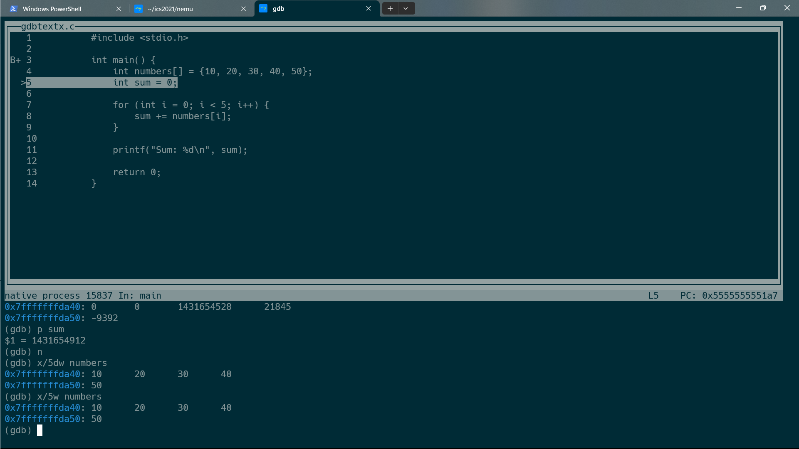
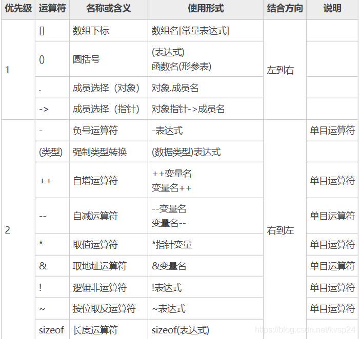

### `monitor.c`

Getopt_long
当您需要在 C 语言程序中处理命令行参数时，`getopt_long()` 函数是一个有用的工具。它可以帮助您解析命令行参数并提供更多的灵活性和功能。`getopt_long()` 函数通过分析命令行参数并将其映射到您定义的选项上，从而使您能够处理短选项（如 `-h`）和长选项（如 `--help`）。

以下是`getopt_long()`函数的介绍和用法：

```c
#include <getopt.h>

int getopt_long(int argc, char * const argv[], const char *optstring, const struct option *longopts, int *longindex);

```

#### 参数说明

- `argc`: 命令行参数的数量。
- `argv`: 命令行参数的数组，由字符串指针组成。
- `optstring`: 用于定义短选项的字符串。每个字符代表一个短选项。如果后面跟着冒号`:`，表示该选项需要一个参数。
- `longopts`: 定义长选项的结构体数组，用于描述长选项的名称、是否需要参数等信息。
- `longindex` : 用于存储找到的长选项在 `longopts` 数组中的索引，如果不需要可以传入 `NULL`
#### 返回值

- 如果找到了一个选项，则返回该选项的短选项字符。
- 如果找到了一个长选项，并且`longindex`不为`NULL`，则返回0，`longindex`中存储找到的长选项在`longopts`数组中的索引。
- 如果所有选项都已解析完毕，则返回-1。
	#### Getopt_long 实例
```c
#include <stdio.h>
#include <stdlib.h>
#include <getopt.h>

int main(int argc, char *argv[]) {
    int option;
    int verbose_flag = 0;
    int number_value = 0;

    // 定义长选项结构体数组
    const struct option long_options[] = {
        {"verbose", no_argument, &verbose_flag, 1},
        {"number", required_argument, NULL, 'n'},
        {NULL, 0, NULL, 0} // 结束标志
    };

    while ((option = getopt_long(argc, argv, "vn:", long_options, NULL)) != -1) {
        switch (option) {
            case 'v':
                printf("Verbose mode enabled.\n");
                break;
            case 'n':
                number_value = atoi(optarg);//optarg是什么?
                //optarg是一个全局变量用来存储选项需要的参数
                //
                printf("Number value set to: %d\n", number_value);
                break;
            case '?':
                // 处理未定义的选项或缺少参数的情况
                break;
            default:
                break;
        }
    }

    // 处理剩余的命令行参数（非选项参数）
    for (int i = optind; i < argc; i++) {
        printf("Non-option argument: %s\n", argv[i]);
    }

    return 0;
}

```

这个示例程序展示了如何使用 `getopt_long()` 函数解析命令行参数。它接受两个选项：`-v`（启用详细模式）和 `-n`（设置一个整数值）。同时，程序可以接受任意数量的非选项参数（即不带前缀的参数），这些参数在处理完选项后被打印出来。

请注意，长选项定义在`long_options`结构体数组中，数组的最后一个元素必须是全零（NULL），用作结束标志。

如果编译并运行这个程序，并在命令行中传递不同的选项和参数，您将看到程序根据您的输入进行相应的处理。例如：
``` shell
$ ./program -v --number 42 inputfile.txt
Verbose mode enabled.
Number value set to: 42
Non-option argument: inputfile.txt

```


`Verbose mode`（详细模式）是在软件或程序中的一种运行模式，通常用于在运行时输出更多详细的信息和状态更新，以便用户或开发者可以更好地了解程序的执行过程和内部运行情况。

在一些命令行工具、编译器、调试器和其他类型的应用程序中，通常会提供详细模式选项。当用户启用详细模式时，程序会输出更多的信息，这些信息可能包括以下内容：

1. **调试信息**: 当程序运行时，会输出额外的调试信息，例如变量的值、函数调用栈、执行流程等，以帮助开发者更容易地定位错误和问题。
    
2. **状态更新**: 程序可能会输出处理过程中的状态更新，例如进度百分比、已完成的步骤数量等，有助于用户了解程序的执行进度。
    
3. **配置信息**: 在详细模式下，程序可能会显示当前的配置选项和参数设置，这对于确保程序运行在期望的设置下很有帮助。
    
4. **警告和错误信息**: 当出现警告或错误时，详细模式可能会输出更具体的信息，以帮助用户理解问题的原因。
    

需要注意的是，启用详细模式可能会导致输出信息变得冗长，因此对于普通用户来说，这可能并不总是必需的。但对于开发人员或调试目的，详细模式是非常有用的功能。

在前面提到的示例程序中，通过使用`-v`选项启用了详细模式。当用户使用该选项时，程序输出了"Verbose mode enabled."这样的信息，表明详细模式已经开启，可能还会在执行过程中输出其他更多的信息。

### `sdb_mainloop. c`
关键的函数在于 readline () strtok ()库函数, nemu 有许多库函数需要去了解 (chatgpt 教学是一种很舒服的)
#### Readline
```c
#include <stdio.h>
#include <readline/readline.h>

int main() {
    char* input = readline("Enter your name: ");
    printf("Hello, %s!\n", input);
    free(input);
    return 0;
}
```

```shell
lsgcc main -o main.c -g
//报错
readline.c:(.text+0x14): undefined reference to `readline'
```

The error message you encountered, "undefined reference to `readline'", indicates that the linker cannot find the definition of the` readline ` function. This typically happens when you use a function that is part of an external library, but you haven't linked your program correctly with that library.

To resolve this issue, you need to ensure that you link your program with the `readline` library correctly. In C/C++, you can link external libraries by adding the necessary compiler flags during the compilation process.

For `readline`, you need to add the `-lreadline` flag to your compilation command to link with the `readline` library. Additionally, you might also need to link with the `history` library, which is required by `readline`, using the `-lhistory` flag.
[external_library](../一些问题/external_library.md)

所以 `filelist.mk` 中自然有
```bash
LIBS += $(if $(CONFIG_TARGET_NATIVE_ELF),-lreadline -ldl -pie,)
```
[makefile 相关的](../一些问题/makefile相关.md)

[readline 相关的](../一些函数/readline.md)

[srrtok](../一些函数/strtok.md)


### Cmd_x (gdb: x)
Examine => x

先来看看 gdb 的扫描内存是怎么使用的吧

在 gdb 中，`x` 是一个非常有用的命令，它用于查看内存中的数据内容。`x` 命令的完整格式为：

复制代码

`x/[显示格式][重复次数] 内存地址`

其中，方括号内的内容是可选的。

- `[显示格式]`：指定显示的数据格式，可以是以下之一：
    
    - `b`：以字节（byte）为单位显示数据
    - `h`：以半字（halfword，2字节）为单位显示数据
    - `w`：以字（word，4字节）为单位显示数据
    - `g`：以双字（giant，8字节）为单位显示数据
    - `s`：以null结尾的字符串
    - `i`：显示指令（汇编代码）
- `[重复次数]`：指定要显示的数据的重复次数。
    
- `内存地址`：要查看的内存地址，可以是十进制或十六进制表示。
    

现在，让我们通过一个示例来演示如何使用`x`命令来调试：

``` c
#include <stdio.h>

int main() {
    int numbers[] = {10, 20, 30, 40, 50};
    int sum = 0;

    for (int i = 0; i < 5; i++) {
        sum += numbers[i];
    }

    printf("Sum: %d\n", sum);

    return 0;
}

```


x/5w numbers 从 numbers (数组起始地址) 作为起始地址以 4bytes 为单位检查内存
#### Paddr. C

Paddrread ()
Vaddrread ()

### 表达式求值
你需要完成以下的内容:

- 为算术表达式中的各种token类型添加规则, 你需要注意C语言字符串中转义字符的存在和正则表达式中元字符的功能.
- 在成功识别出token后, 将token的信息依次记录到`tokens`数组中.

### regex 介绍

#### regex 的简单介绍
1. 元字符 (meta characters)

| 元字符 | 描述                                           |
| ------ | ---------------------------------------------- |
| .      | 句号匹配任意 `单个` 字符除了换行符             |
| []     | 字符种类. 匹配方括号内的任意字符               |
| \[^\]  | 否定的字符种类                                 |
| *      | 匹配>=0 个重复在\*号前的字符                   |
| +      | 匹配>=1 个重复在+号前的字符                    |
| ?      | 标记? 之前的字符是可选的                       |
| {n, m} | 匹配 num 个大括号之前的字符或字符集{n<=num<=m} |
| (xyz)  | 匹配和 xyz 完全相等的字符串                    |
| \|     | 或运算符, 匹配符号前或后的字符                 |
| \      | 转义字符, 用于匹配一些保留的字符例如 `[] () {}`           | 
2. 示例
2.2 字符集
---
```markdown
"[Tt]he" => `The` car parked in `the` garage
```

#### regcomp
```c
int regcomp(regex_t* restrict compiled_regex,const char*restrict pattern,int flags);
```

- `compiled_regex` 是一个指向 `regex_t` 结构体的指针，用于存储编译后的正则表达式。
- `pattern` 是一个以空字符结尾的字符串，表示待编译的正则表达式。(应该注意 pattern 中各个规则的顺序, 高频匹配的在前面)
- `cflags` 是编译选项，可以通过位掩码来指定不同的选项，例如 `REG_EXTENDED` 表示启用扩展正则表达式。
1. `regcomp` 函数会根据传入的正则表达式字符串和选项编译正则表达式，并将编译结果存储在 `compiled_regex` 中。如果编译成功，返回值为 0；否则返回一个非零错误代码。
#### regexec
`regexec` 函数：该函数用于在给定的字符串中执行先前编译的正则表达式。其语法如下：

```c
int regexec(const regex_t *restrict compiled_regex, const char *restrict string, size_t nmatch,
            regmatch_t pmatch[], int eflags);
```

- `compiled_regex` 是之前使用 `regcomp` 编译得到的正则表达式。
- `string`是待匹配的字符串。
- `nmatch`表示`pmatch`数组的大小，用于指定期望的匹配结果数量。
- `pmatch` 是一个用于存储匹配结果的数组。
	```c
	typedef struct

{

  regoff_t rm_so;  /* Byte offset from string's start to substring's start.  */

  regoff_t rm_eo;  /* Byte offset from string's start to substring's end.  */

} regmatch_t;	
	```
- `eflags` 是执行选项，可以通过位掩码来指定不同的选项。

1. `regexec`函数会在给定的字符串中执行先前编译的正则表达式，并尝试找到与之匹配的子字符串。如果找到匹配，返回值为0；否则返回一个非零错误代码。匹配结果将存储在`pmatch`数组中的`regmatch_t`结构体中。
#### tips
##### gdb 出现重叠
在 `gdb` 中，你可以使用 `Ctrl+L`（也可以写作 `Ctrl+L` 或 `C-l`）来重新绘制页面，即清屏并重新显示当前内容。这个快捷键在终端中通常被用来刷新显示，清除屏幕并重新绘制当前内容，从而使终端界面更清晰。

当在 `gdb` 的调试会话中使用 `layout src` 或其他显示功能时，有时可能会遇到终端字符重叠或显示不正确的情况。这时，你可以尝试使用 `Ctrl+L` 快捷键来重新绘制页面，希望能够解决显示问题。

另外，如果 `Ctrl+L` 不起作用，你可以尝试输入 `shell clear` 命令，它会调用终端的清屏命令来清除屏幕并重新绘制内容。注意，`shell clear` 命令会暂时离开 `gdb` 的命令行界面，执行系统的 `clear` 命令后再返回到 `gdb`。

总之，`Ctrl+L` 和 `shell clear` 命令都可以用来重绘 `gdb` 的显示界面，以解决可能出现的字符重叠或显示问题。如果问题持续存在，可能需要考虑其他终端设置或 `gdb` 配置方面的问题。
##### \\\\ 转义为那般?
在 Ubuntu 平台下，正则表达式中需要使用两个反斜杠（\）来进行转义的原因是因为反斜杠在 Unix/Linux 系统中有特殊的含义。单个反斜杠被用作转义字符，用于指示后面的字符应该被解释为特殊字符而不是字面量。

例如，如果你想匹配一个句号（.），你需要在正则表达式中使用两个反斜杠来转义它，即"\."。第一个反斜杠用来转义第二个反斜杠，告诉正则表达式引擎将其视为字面量的句号。

这种行为与编程语言中的字符串转义类似，因为在许多编程语言中，反斜杠也被用作转义字符。因此，在正则表达式中使用两个反斜杠来转义特殊字符可以保持一致性，并与其他代码保持统一。

----
一篇比较好的 posix 标准的regex
https://www.cnblogs.com/lovers/p/POSIXREGEX.html

##### Log
```c
Log("match rules[%d] = \"%s\" at position %d with len %d: %.*s",

            i, rules[i].regex, position, substr_len, substr_len, substr_start);
```
`%.*s` 是格式化输出字符串的一种方式，常用于在 C 语言中格式化打印字符串的一部分。

在格式化输出中，`%` 是格式控制符的开始标记，而 `.*s` 是一个组合，表示一个格式化输出字段，它的作用是输出一个字符串，并通过参数动态指定要输出的字符串长度。

具体来说：
- `%` ：表示这是一个格式控制符。
- `.*` ：表示使用参数进行长度控制，`*` 表示占位的位置，会被后面的参数填充。
- `s` ：表示输出字符串。

在 `%.*s` 中，`.*` 会被两个参数替换：
1. 第一个参数（在格式字符串之后的参数列表中）用于指定要输出的字符串的长度。
2. 第二个参数（在格式字符串之后的参数列表中）是要输出的字符串的地址。

这种格式化输出的形式对于只想输出字符串的一部分，而不是整个字符串，是很有用的。

下面是一个示例，演示如何使用 `%.*s` 进行格式化输出：

```c
#include <stdio.h>

int main() {
    const char *str = "Hello, World!";
    int length = 5; // Number of characters to print

    printf("Printing the first %d characters: %.*s\n", length, length, str);

    return 0;
}
```

在这个示例中，`%.*s` 会根据给定的长度 `length`，只输出字符串的前几个字符。在实际应用中，你可以动态地根据需要输出不同长度的子字符串。


#### Vscode 开发大型程序时会不能识别出一些头文件的包含路径
##### 怎么解决?
https://www.kdab.com/improving-cpp-dev-in-vs-code/
`Improving C++ Development in Visual Studio Code with compile_commands.json and Bear`

You won't be able to `Ctrl+click` to follow symbols;
You'll get error squiggles under each unrecognized `#include`
, which is an overall annoying experience.

Of course, you can go to [`c_cpp_properties.json`](https://code.visualstudio.com/docs/cpp/c-cpp-properties-schema-reference) and painstakingly configure your `"includePath"` and `"defines,"` but that’s a lot of work — particularly if your project is large and uses multiple external libraries.

##### Solutions
1. `sudo apt install bear`
2. `bear -- make //记得先make clean
3. `mv compile_commands.json .vscode/`
4. You’ll point VS Code towards this file and the code model will pick up the necessary configuration.

### 先开始做
再开始完善也是一种工作哲学


## watchpoint


### 扩展

```c
<expr> ::= <decimal-number>
  | <hexadecimal-number>    # 以"0x"开头
  | <reg_name>              # 以"$"开头
  | "(" <expr> ")"
  | <expr> "+" <expr>
  | <expr> "-" <expr>
  | <expr> "*" <expr>
  | <expr> "/" <expr>
  | <expr> "==" <expr>
  | <expr> "!=" <expr>
  | <expr> "&&" <expr>
  | "*" <expr>              # 指针解引用
```
#### 优先级prior
在扩展表达式的实现中, 发现原来对优先级的实现比较幼稚
1. 级别有些问题, 最优先的 prior 应该最小, 我本来整反了.



当然没问题！以下是 C 语言常见运算符按照优先级从高到低的顺序，以表格形式呈现：

| 优先级 | 运算符                           | 描述               |
| ------ | -------------------------------- | ------------------ |
| 1      | ()                               | 圆括号             |
| 2      | ++ --                            | 递增 / 递减        |
|        | + -                              | 正号 / 负号        |
|        | ! ~                              | 逻辑非 / 按位取反  |
|        | (type)                           | 强制类型转换       |
|        | *                                | 指针解引用         |
|        | &                                | 地址运算符         |
|        | sizeof                           | 获取大小           |
| 3      | * / %                            | 乘法 / 除法 / 求模 |
| 4      | + -                              | 加法 / 减法        |
| 5      | << >>                            | 左移 / 右移        |
| 6      | < <= > >=                        | 关系运算符         |
| 7      | == !=                            | 相等 / 不等        |
| 8      | &                                | 按位与             |
| 9      | ^                                | 按位异或           |
| 10     | \|                               | 按位或             |
| 11     | &&                               | 逻辑与             |
| 12     | \|\|                             | 逻辑或             |
| 13     | ?:                               | 条件运算符         |
| 14     | =                                | 赋值               |
|        | += -= *= /= %= &= \|= ^= <<= >>= | 复合赋值           |      

这个表格显示了 C 语言中常见运算符的优先级顺序，这将有助于您正确编写表达式和避免运算符优先级错误。
```c
 // for(int i=p;i<=q;i++){

      //   if(tokens[i].type=='('){

      //     count++;

      //     continue;//Skipping to the next iteration directly (utilizing a comment from ChatGPT).

      //   }

      //   else if(tokens[i].type==')'){

      //     count--;

      //     continue;

      //   }

      //   if(count==0){

      //   if(tokens[i].type=='+'&&prior>=1){

      //     op = i;

      //     op_type = '+';

      //     prior = 1;

      //   }

      //   if (tokens[i].type=='-'&&prior>=1)

      //   {

      //     op = i;

      //     op_type = '-';

      //     prior = 1;

      //   }

      //   if (tokens[i].type=='*'&&prior>=2)

      //   {

      //     op = i;

      //     op_type = '*';

      //     prior = 2;

      //   }

      //   if (tokens[i].type=='/'&&prior>=2)

      //   {

      //     op = i;

      //     op_type = '/';

      //     prior = 2;

      //   }

      //   if (tokens[i].type==TK_AND&&prior>=3)

      //   {

      //     op = i;

      //     op_type = TK_AND;

      //     prior = 3;

      //   }

      //   if(tokens[i].type==TK_EQ&&prior>=3){

      //     op = i;

      //     op_type = TK_EQ;

      //     prior = 3;

      //   }

      //   if (tokens[i].type==TK_NEG&&prior>=3)

      //   {

      //     op = i;

      //     op_type = TK_NEG;

      //     prior = 3;

      //   }

      // }

      // }

      // int val1 = eval(p,op-1);

      // int val2 = eval(op+1,q);
```
本来觉得之前实现好了, 改下顺序+集成为函数不算什么难事, 结果还是不能一次写好, 排查错误 (1. 通宵后早起写代码导致, 连括号匹配了 (但没完全匹配, return 的地方应该在 for 循环外面), 然后改完发现还是经典问题 (1-1+10=-10), 得益于 ysyx 项目强调的要写好笔记, 我之前记录这种情况, 典型的是没有写好结合性的, 直接无脑在判断处改为<=

#### 寄存器

关于获取寄存器的值, 这显然是一个 ISA 相关的功能. 框架代码已经准备了如下的 API:

```c
// nemu/src/isa/$ISA/reg.c
word_t isa_reg_str2val(const char *s, bool *success);
```

它用于返回名字为`s`的寄存器的值, 并设置`success`指示是否成功.

```c
if(tokens[p].type == POINT){  
				if (!strcmp(tokens[p + 2].str, "$eax")){  
					result = swaddr_read(cpu.eax, 4);  
					return result;  
				} else if (!strcmp(tokens[p + 2].str, "$ecx")){  
					result = swaddr_read(cpu.ecx, 4);  
					return result;  
				} else if (!strcmp(tokens[p + 2].str, "$edx")){  
					result = swaddr_read(cpu.edx, 4);  
					return result;  
				} else if (!strcmp(tokens[p + 2].str, "$ebx")){  
					result = swaddr_read(cpu.ebx, 4);  
					return result;  
				} else if (!strcmp(tokens[p + 2].str, "$esp")){  
					result = swaddr_read(cpu.esp, 4);  
					return result;  
				} else if (!strcmp(tokens[p + 2].str, "$ebp")){  
					result = swaddr_read(cpu.ebp, 4);  
					return result;  
				} else if (!strcmp(tokens[p + 2].str, "$esi")){  
					result = swaddr_read(cpu.esi, 4);  
					return result;  
				} else if (!strcmp(tokens[p + 2].str, "$edi")){  
					result = swaddr_read(cpu.edi, 4);  
					return result;  
				} else if (!strcmp(tokens[p + 2].str, "$eip")){  
					result = swaddr_read(cpu.eip, 4);  
					return result;
```


```c
const char *regs[] = {

  "$0", "ra", "sp", "gp", "tp", "t0", "t1", "t2",

  "s0", "s1", "a0", "a1", "a2", "a3", "a4", "a5",

  "a6", "a7", "s2", "s3", "s4", "s5", "s6", "s7",

  "s8", "s9", "s10", "s11", "t3", "t4", "t5", "t6"

};
```


正则表达式匹配
```
	  {"\\$\\$0|\\$ra|\\$sp|\\$gp|\\$tp|\\$t[0-6]|\\$s[0-7]|\\$a[0-7]",TK_REG},
```

匹配到的是寄存器的名字多了\$所以复制到

```c
 case TK_REG:

              tokens[nr_token].type = TK_REG;

              strncpy(tokens[nr_token].str,substr_start+1,substr_len-1);

              nr_token++;

              break;

```