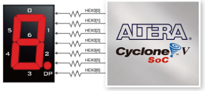

[必做题](../../ysyx课程/必做题.md) 
以下部分是**必做题**：

- 实验一 选择器
- 实验二 译码器和编码器
- 实验三 加法器与ALU
- 实验六 移位寄存器及桶形移位器
- 实验七状态机及键盘输入
### 录制 gif
ubuntu 中有 peek 可以非常方便的录制 gif

### 实验一 选择器

```Verilog
#利用模板

module MuxKeyInternal #(NR_KEY = 2, KEY_LEN = 1, DATA_LEN = 1, HAS_DEFAULT = 0) (
  output reg [DATA_LEN-1:0] out,
  input [KEY_LEN-1:0] key,
  input [DATA_LEN-1:0] default_out,
  input [NR_KEY*(KEY_LEN + DATA_LEN)-1:0] lut
);

  localparam PAIR_LEN = KEY_LEN + DATA_LEN;
  wire [PAIR_LEN-1:0] pair_list [NR_KEY-1:0];
  wire [KEY_LEN-1:0] key_list [NR_KEY-1:0];
  wire [DATA_LEN-1:0] data_list [NR_KEY-1:0];

  generate
    for (genvar n = 0; n < NR_KEY; n = n + 1) begin
      assign pair_list[n] = lut[PAIR_LEN*(n+1)-1 : PAIR_LEN*n];
      assign data_list[n] = pair_list[n][DATA_LEN-1:0];
      assign key_list[n]  = pair_list[n][PAIR_LEN-1:DATA_LEN];
    end
  endgenerate

  reg [DATA_LEN-1 : 0] lut_out;
  reg hit;
  integer i;
  always @(*) begin
    lut_out = 0;
    hit = 0;
    for (i = 0; i < NR_KEY; i = i + 1) begin
      lut_out = lut_out | ({DATA_LEN{key == key_list[i]}} & data_list[i]);
      hit = hit | (key == key_list[i]);
    end
    if (!HAS_DEFAULT) out = lut_out;
    else out = (hit ? lut_out : default_out);
  end

endmodule

module MuxKey #(NR_KEY = 2, KEY_LEN = 1, DATA_LEN = 1) (
  output [DATA_LEN-1:0] out,
  input [KEY_LEN-1:0] key,
  input [NR_KEY*(KEY_LEN + DATA_LEN)-1:0] lut
);
  MuxKeyInternal #(NR_KEY, KEY_LEN, DATA_LEN, 0) i0 (out, key, {DATA_LEN{1'b0}}, lut);
endmodule

module MuxKeyWithDefault #(NR_KEY = 2, KEY_LEN = 1, DATA_LEN = 1) (
  output [DATA_LEN-1:0] out,
  input [KEY_LEN-1:0] key,
  input [DATA_LEN-1:0] default_out,
  input [NR_KEY*(KEY_LEN + DATA_LEN)-1:0] lut
);
  MuxKeyInternal #(NR_KEY, KEY_LEN, DATA_LEN, 1) i0 (out, key, default_out, lut);
endmodule

module lab03mux41(
    input [1:0] a0,a1,a2,a3,
    input [1:0] sel,
    output [1:0] out
);
    MuxKeyWithDefault #(4,2,2) io (out,sel,2'b00,{
        2'b00,a0,
        2'b01,a1,
        2'b10,a2,
        2'b11,a3
    });
endmodule
```
看不太懂, 明天看看那本黑书先

您提到的观点非常有深度，涉及到了硬件描述语言（HDL）设计的基本理念以及初学者可能面临的困惑。让我来回答您的问题和提供进一步的解释：

1. **“描述电路”的本质：**
    
    - 在硬件描述语言中，"描述电路" 的本质是通过语言来定义电路的行为和结构，以便能够进行综合、仿真和验证。这与传统的编程语言（如C语言）有很大不同，因为硬件描述语言关注的是电路的结构和行为，而不仅仅是算法执行。
    - 初学者在使用硬件描述语言时，的确可能会受到编程思维的影响，误以为可以直接用类似C语言的思维来描述电路，这可能会导致电路设计的不准确和不可综合。
2. **行为建模和描述电路：**
    
    - 行为建模在某些情况下可以使电路描述更为直观和简洁，但的确容易引入错误或不良的综合结果。这是因为行为建模和硬件的本质不同，它们之间的转化可能需要综合工具进行复杂的优化和转换。
    - 对于初学者，更直接的数据流建模和结构化建模方式可能更容易理解和掌握。这样的描述方式更符合电路的本质，有助于避免不必要的转化和优化问题。
3. **关于问题的回答：**
    
    - 在硬件描述语言中，"执行" 指的是电路的行为被表示并用于综合。
    - 在Verilog中，执行是由综合器在转化为实际电路时进行的过程。硬件描述语言并非是一种传统的程序语言，其中的语句不一定是按照程序式的顺序执行。
    - 在条件语句中，"不执行" 意味着综合器不会生成对应的电路逻辑。这与传统编程语言中的"不执行" 是不同的，因为在电路中，无用的逻辑会导致面积和功耗的浪费。
4. **并发执行和顺序执行：**
    
    - 在硬件描述语言中，可以通过组合逻辑实现并发执行，通过时钟触发实现顺序执行。
    - 并发执行是指多个逻辑部分在同一时间步骤内同时工作，而顺序执行是指逻辑部分按照时序进行工作。这两者都是描述电路行为的重要概念。

这些问题和解释可以帮助初学者更好地理解硬件描述语言的本质和适用方式。对于初学者来说，从数据流建模和结构化建模开始，逐步理解并运用并发和顺序执行的概念，能够更好地为他们的电路设计和描述提供基础。

电路综合是硬件设计流程中的一个重要步骤，它将高级硬件描述语言（如 Verilog 或 VHDL）表示的逻辑电路转换成低级门级电路的过程。综合器是执行这一转换的工具。

综合的目标是将高级抽象的电路描述转换为逻辑门（AND、OR、NOT 等）和触发器（Flip-Flops）的组合，以及必要的连线。综合器会根据设计规范和约束，以及所使用的目标技术库（Standard Cell Library），自动推导出最优的硬件结构，以满足特定的性能和面积要求。

综合的过程可以概括为以下步骤：

1. **语法和语义分析：** 综合器首先会对输入的硬件描述语言代码进行语法和语义分析，确保代码的正确性和一致性。
    
2. **优化：** 综合器会进行一系列优化，例如常数传播、公共子表达式消除、逻辑合并等，以尽可能地简化电路并优化其性能。
    
3. **行为转换：** 综合器将高级行为描述转换为结构级描述，例如将多位加法器转换为多个逻辑门。
    
4. **逻辑综合：** 在这一阶段，综合器将高级描述转换为标准的逻辑门和触发器，以及它们之间的连线。这是综合器的核心部分。
    
5. **时序分析和优化：** 综合器会对电路的时序进行分析，以确保满足设计规范中的时序要求。如果时序不满足，综合器可能会尝试进行优化，例如改变逻辑结构或引入额外的时钟周期等。
    
6. **生成网表：** 综合器输出一个中间表示形式，称为网表（Netlist）。网表是一个逻辑级的电路表示，其中包含所有逻辑门和触发器以及它们之间的连接信息。
    
7. **后端布局布线：** 生成的网表随后将用于后端布局布线过程，这是将逻辑电路映射到实际物理器件的过程。在这一阶段，综合的输出将被放置在芯片上，并通过连线来实现实际的电路连接。
    

综合器的输出网表随后将被发送给后端工具链，完成实际的芯片制造流程。电路综合是硬件设计流程中的重要环节，确保高级抽象的设计能够转换为可实现的硬件电路。
### 实验二译码器和编码器

#### case4
>查阅相关资料，了解 casex 和 casez 语句的使用，思考如何用 casex 语句来完成优先编码器的设计？


### 实验三加法器与 ALU

报错
```
%Error-PROCASSWIRE: /home/along/ysyx-workbench/npc/vsrc/lab05alu.v:45:17: Procedural assignment to wire, perhaps intended var (IEEE 1800-2017 6.5): 'out'
                                                                        : ... In instance lab05alu
   45 |         3'b000: out = outadd;
      |                 ^~~
```


```
%Warning-WIDTHEXPAND: /home/along/ysyx-workbench/npc/vsrc/lab05alu. v: 36:26 : Operator ADD expects 8 bits on the RHS, but RHS's VARREF 'completb' generates 4 bits.
                                                                          : ... In instance lab05alu
   36 | assign {carry, outadd} = a+completb;
      |                          ^
%Error: Exiting due to 2 warning (s)
```


### 实验六移位寄存器及桶形移位器
### 实验七状态机及键盘输入

> - 七段数码管低两位显示当前按键的键码，中间两位显示对应的 ASCII 码（转换可以考虑自行设计一个 ROM 并初始化）。只需完成字符和数字键的输入，不需要实现组合键和小键盘。
 >   
> - 当按键松开时，七段数码管的低四位全灭。
  >  
> - 七段数码管的高两位显示按键的总次数。按住不放只算一次按键。只考虑顺序按下和放开的情况，不考虑同时按多个键的情况。
-------

为 nvboard 添加按钮功能

可以将 rst 信号映射到 RST 上
但是我直接使用 `top.nxdc` 来绑定引脚又是不行的, 我猜测是 `autobind.py` 的问题


```c
	
	nvboard_bind_pin(&top->rst,BIND_RATE_RT,BIND_DIR_IN,1,RST);

```

1. 先梳理好 ps2_keyboard.v
2. 还有初始化 rom 来映射 keycode -> ASCII
3. 



0~6 即 SEGA-G, DP 即 DECOP
```c
#define SEG7_SEGS_OUTPUT SEG0A, SEG0B, SEG0C, SEG0D, SEG0E, SEG0F, SEG0G, DEC0P, \
                         SEG1A, SEG1B, SEG1C, SEG1D, SEG1E, SEG1F, SEG1G, DEC1P, \
                         SEG2A, SEG2B, SEG2C, SEG2D, SEG2E, SEG2F, SEG2G, DEC2P, \
                         SEG3A, SEG3B, SEG3C, SEG3D, SEG3E, SEG3F, SEG3G, DEC3P, \
                         SEG4A, SEG4B, SEG4C, SEG4D, SEG4E, SEG4F, SEG4G, DEC4P, \
                         SEG5A, SEG5B, SEG5C, SEG5D, SEG5E, SEG5F, SEG5G, DEC5P, \
                         SEG6A, SEG6B, SEG6C, SEG6D, SEG6E, SEG6F, SEG6G, DEC6P, \
                         SEG7A, SEG7B, SEG7C, SEG7D, SEG7E, SEG7F, SEG7G, DEC7P


```


### 对于共阴极数码管来说

对应 pin 输出 1, 所以有如下输出表 (table)
```verilog
assign segs[0] = 8'b11111101;
assign segs[1] = 8'b01100000;
assign segs[2] = 8'b11011010;
assign segs[3] = 8'b11110010;
assign segs[4] = 8'b01100110;
assign segs[5] = 8'b10110110;
assign segs[6] = 8'b10111110;
assign segs[7] = 8'b11100000;
```

#### 调试 python 代码的方法

``` makefile
# constraint file
SRC_AUTO_BIND = $(abspath $(BUILD_DIR)/auto_bind.cpp)
$(SRC_AUTO_BIND): $(NXDC_FILES)
	python3 $(NVBOARD_HOME)/scripts/auto_pin_bind.py $^ $@
```

\$^ 是指 prerequisites , 也就是$ (NXDC_FILE)
	
\$@  是指 target , 也就是 $(SRC_AUTO_BIND )

很难绷的住的是, 我在这里才明白 nvboard 中的 python 脚本的代码
总之 `auto_pin_bind.py` 是需要

```shell
Usage: python3 auto_pin_bind.py nxdc_constraint_file_path auto_bind_c_output_file_path
```

```bash
cons_path = sys.argv[1]
  output_path = sys.argv[2]
  boardfile_path = os.path.join(nvboard_path, "board/N4")
```

大概扫了一下剩余的大概也是词法分析之类的功能把, 
把 NXDC => `auto_pins_bind.cpp`


